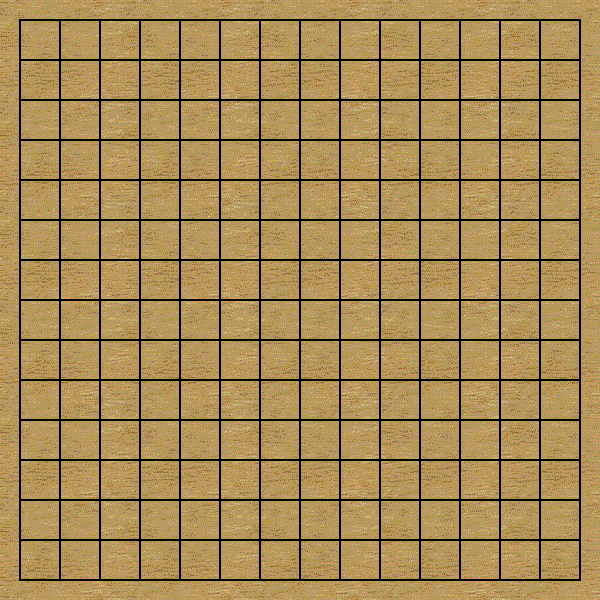

# RL Gobang

## Kickstart

```sh
bazel build -c opt //mcts:capi
pip install -r requirements.txt
```

## Training

Training uses multiple self-play processes and a single training process.
Each self-play process runs MCTS search with neural network oracle to generate self-play games.
Then these games will be transmitted to the training process with IPC
to improve the neural network oracle.
The training process also features a evaluator to check whether the new neural network is
better than the previous check point.
The evaluation criterion is that A is better than B only if A wins B with
white stone (defensive position).
Only when a definitely stronger network has arisen, new check point will be saved.

The `master` executable controls the training and self-play processes.
It decides the number of self-play processes, which is decisive to the generating speed.
`master` always finishes immediately since it only creates and terminates the worker processes.
The worker processes (training/self-playing) exists in the form of daemons.
So it may need additional efforts to deploy the program to Windows systems. 

```sh
# start training
python src/master.py start

# end training
python src/master.py kill
```

## Playing with Checkpoints

`gobang_env` is a GUI program to visualize the level of certain checkpoint.
It also contains functions to save the playing history to images.

```sh
python src/gobang_env.py
```

## Achievements

- Wins one of the strongest gomoku AI on Android phones, tito, with black stone.



- Gets high rank at the platform "微信小程序-欢乐五子棋腾讯版" (on progress).

## Paper

[AlphaZero](https://deepmind.com/blog/article/alphazero-shedding-new-light-grand-games-chess-shogi-and-go)